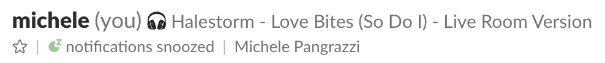
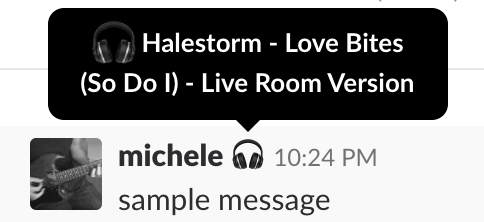

spotify-status-on-slack
===

A very simple `bash` script to set Slack status to your currently playing track on Spotify.

# How to use

- Clone this repo somewhere

- Set `LEGACY_TOKEN` var to the correct value. For more info, read [here](https://api.slack.com/custom-integrations/legacy-tokens)

- Set a reasonable personal crontab, e.g. to your working hours

  ```bash
  * 9-18 * * 1-5 ./main.sh >/dev/null 2>&1 # remember to set correctly the path of main.sh
  ```

- Listen to a song on Spotify :) You'll see that your Slack status will be updated, e.g.:

  

- If someone hovers your status the track currently played by Spotify will appear on tooltip

  

- When you quit Spotify, stop playing tracks or simply pause playing, your current Slack status will be cleared

## Why?

I was thinking about a simple way to let your colleagues/teammates know that you're listening to some songs on (head|ear)phones, so maybe you can't hear them if they will try to call you.

Also, could be a way to let other people know your musical tastes :)

## TODO

- Instead of using a Legacy Token, setup a basic [Slack App](https://api.slack.com/custom-integrations#migrating_to_apps)

## Note

- It runs only on Mac OS X since it uses `osascript`.
- It's the result of a 30-min spike at ~10PM

Copyright 2018 Michele Pangrazzi <xmikex83@gmail.com>

Permission is hereby granted, free of charge, to any person obtaining a copy of this software and associated documentation files (the "Software"), to deal in the Software without restriction, including without limitation the rights to use, copy, modify, merge, publish, distribute, sublicense, and/or sell copies of the Software, and to permit persons to whom the Software is furnished to do so, subject to the following conditions:

The above copyright notice and this permission notice shall be included in all copies or substantial portions of the Software.

THE SOFTWARE IS PROVIDED "AS IS", WITHOUT WARRANTY OF ANY KIND, EXPRESS OR IMPLIED, INCLUDING BUT NOT LIMITED TO THE WARRANTIES OF MERCHANTABILITY, FITNESS FOR A PARTICULAR PURPOSE AND NONINFRINGEMENT. IN NO EVENT SHALL THE AUTHORS OR COPYRIGHT HOLDERS BE LIABLE FOR ANY CLAIM, DAMAGES OR OTHER LIABILITY, WHETHER IN AN ACTION OF CONTRACT, TORT OR OTHERWISE, ARISING FROM, OUT OF OR IN CONNECTION WITH THE SOFTWARE OR THE USE OR OTHER DEALINGS IN THE SOFTWARE.
